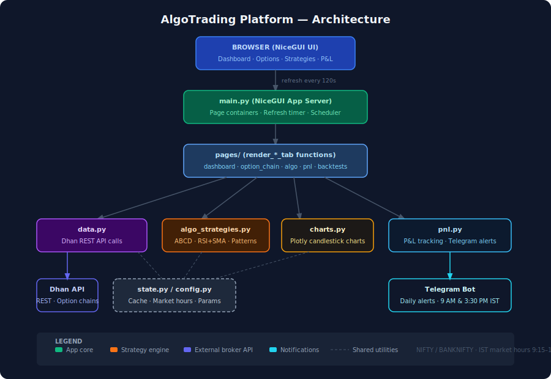

# AlgoTrading — NIFTY & BANKNIFTY Options Platform

A web-based algorithmic trading dashboard for intraday options trading on Indian equity indices (NIFTY and BANKNIFTY), powered by [NiceGUI](https://nicegui.io), the [Dhan broker API](https://dhanhq.co), and multiple technical analysis strategies.



---

## Features

- **Live trading signals** — ABCD harmonic patterns and RSI+SMA crossover strategy during market hours
- **7 backtestable strategies** — RSI-only, ABCD, double tops/bottoms, channel breakouts, SMA50
- **Options analytics** — ATM option chain with Greeks (delta, gamma, theta, vega), IV, LTP, and trend
- **P&L tracking** — realized and unrealized P&L with win-rate stats; 90-day trade history
- **Telegram alerts** — automated daily summaries at 9 AM and 3:30 PM IST
- **Market awareness** — holiday calendar, countdown timer when market is closed, dual IST/CEST clocks
- **Auto-refresh** — all data refreshes every 120 seconds; hot-reload during development

---

## Getting Started

### Prerequisites

- Python 3.10+
- [`uv`](https://github.com/astral-sh/uv) package manager
- Dhan broker account with API access
- Telegram bot token (optional, for alerts)

### Install

```bash
uv sync
```

### Configure

Copy the example environment file and fill in your credentials:

```bash
cp .env.example .env
```

`.env` variables:

| Variable | Description |
|----------|-------------|
| `DHAN_CLIENT_CODE` | Dhan broker client ID |
| `DHAN_TOKEN_ID` | Dhan JWT access token |
| `DHAN_BOT_TOKEN` | Telegram bot token |
| `DHAN_PAPER_TRADING` | `True` for paper trading, `False` for live |
| `RECEIVER_CHAT_IDS` | Comma-separated Telegram chat IDs |
| `GMAIL_USERNAME` | Gmail address (optional email alerts) |
| `APP_PASSWORD` | Gmail app password |
| `RECEIVER_EMAIL` | Recipient email address |

### Run

```bash
cd nicegui_app
uv run python main.py
```

Opens the dashboard at **http://0.0.0.0:8501**. The app hot-reloads on file saves.

---

## Architecture

```
Browser → main.py (refresh every 120s) → data.py → Dhan REST API
                                        → algo_strategies.py → state._trade_store
                                        → charts.py → Plotly figures
                                        → pnl.py → Telegram alerts
```

See the full diagram: [docs/architecture.svg](docs/architecture.svg)

### Key Modules

| File | Role |
|------|------|
| `main.py` | NiceGUI entry point; page containers, refresh timer, scheduler |
| `config.py` | IST timezone, NSE holidays, market hours, algo parameters |
| `state.py` | In-memory cache (90s TTL), trade store, market status check |
| `data.py` | Dhan API: option chains, index candles, expiries |
| `algo_strategies.py` | Signal detection: ABCD, RSI+SMA, patterns |
| `charts.py` | Plotly candlestick builders |
| `pnl.py` | P&L collection; Telegram summaries |
| `sidebar.py` | Left drawer navigation |
| `ui_components.py` | Reusable NiceGUI widgets |

### Pages (`nicegui_app/pages/`)

| Page | Description |
|------|-------------|
| `dashboard.py` | Dual clocks (IST/CEST), NIFTY/BANKNIFTY spot prices |
| `markets.py` | NSE index overview grid |
| `option_chain.py` | ATM option chain with Greeks, IV, LTP, trend |
| `algo.py` | Live trading UI (visible only during market hours) |
| `pnl_tab.py` | Realized & unrealized P&L with win-rate stats |
| `rsi_only.py` | RSI backtest (15-min candles, 5-day window) |
| `abcd_only.py` | ABCD harmonic backtest |
| `double_top_only.py` | Double top pattern backtest |
| `double_bottom_only.py` | Double bottom pattern backtest |
| `channel_breakout_only.py` | Channel breakout backtest |
| `sma50_only.py` | SMA 50 crossover backtest |
| `market_closed.py` | Countdown shown when market is closed |

---

## Strategies

### ABCD Harmonic Pattern
Detects 4-swing sequences (A→B→C→D) where BC retraces 61.8–78.6% of AB and the CD/AB ratio is 100–161.8%.
- **Bullish:** entry at D, target = D + AB length, SL = C
- **Bearish:** mirror of the above

### RSI + SMA Crossover
- **BUY:** fast SMA(9) crosses above slow SMA(21) with RSI > 30
- **SELL:** fast SMA crosses below slow with RSI < 70
- Applied to 5-minute option candles

### RSI Only
- **BUY:** RSI(14) recovers back above 30 from oversold
- **SELL:** RSI drops back below 70 from overbought
- 1.5% profit target, 1% stop loss

### Additional Patterns
Double Top / Double Bottom · Channel Breakout · Channel Down · SMA50 crossover

---

## Dhan API Constraints

- Supported candle intervals: **1, 5, 15, 25, 60** minutes (30 is not supported)
- Max 5 trading days per intraday request
- NIFTY: `security_id="13"`, BANKNIFTY: `security_id="25"`, `segment="IDX_I"`

---

## Project Structure

```
algotrading/
├── nicegui_app/          # Active development — web dashboard
│   ├── pages/            # Tab/page components
│   ├── main.py
│   ├── algo_strategies.py
│   ├── charts.py
│   ├── data.py
│   ├── pnl.py
│   ├── state.py
│   └── config.py
├── dhan_services/        # Telegram & utility services
├── docs/                 # Architecture diagram
├── strategies/           # Shared indicators
├── zerodha_kite/         # Legacy — Zerodha integration (unused)
├── dhan_websockets/      # Legacy — WebSocket feed (unused)
├── pyproject.toml
└── .env
```

---

## License

Private — all rights reserved.
